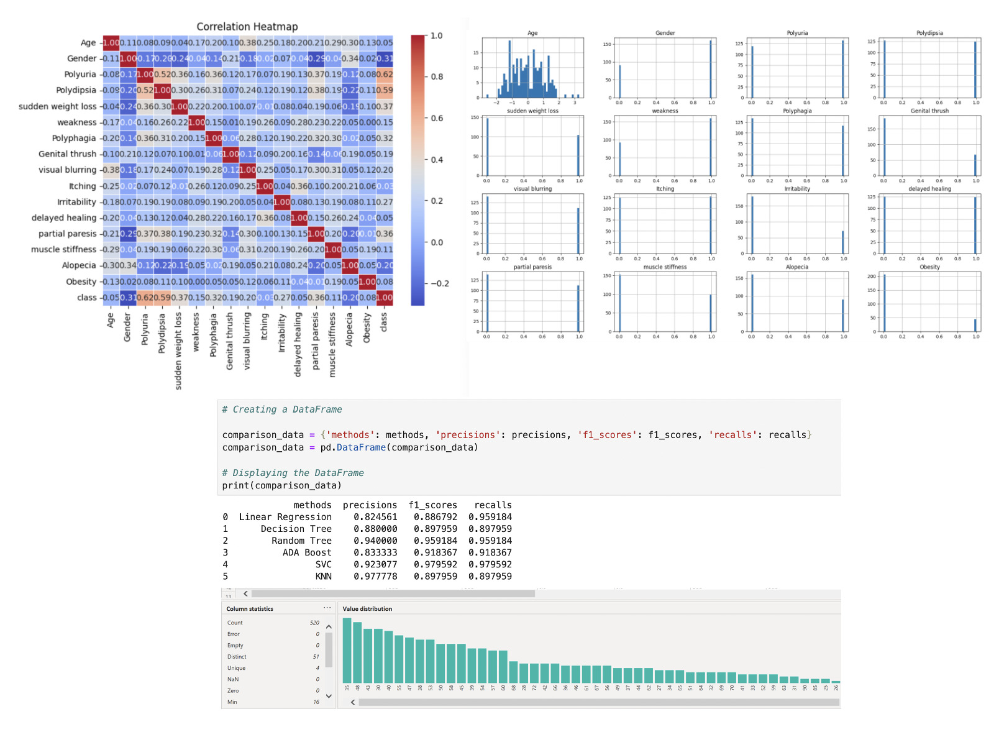
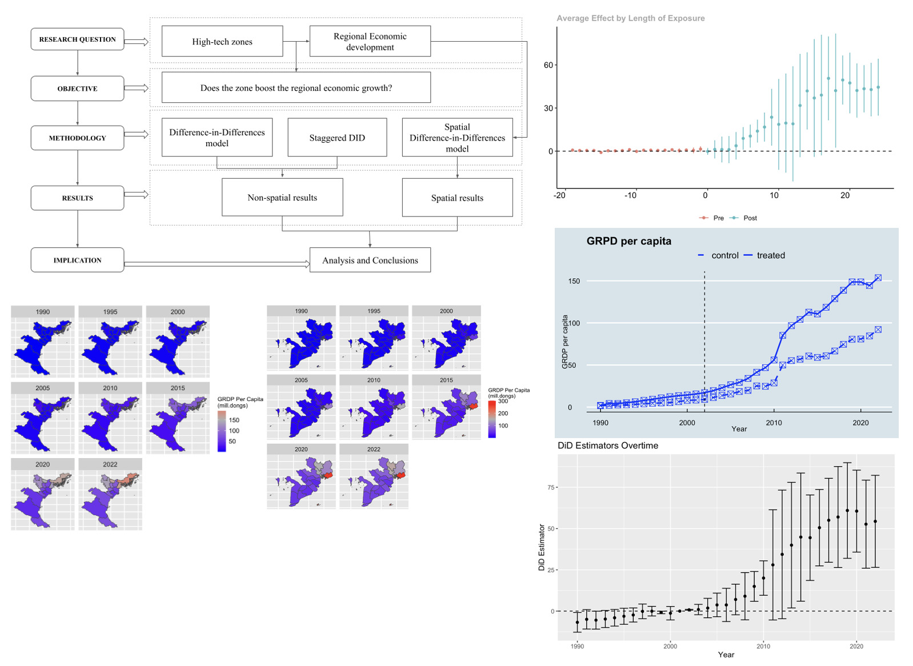

# Data Analyst

#### About me
I am an experienced KAM and BD in Tech transforming into a Data Analyst, with vast experience with major clients in international working environments.
Master degree graduate in Economics from Central University of Economics and Finance (Top 1 Economics school in China). 
Seeking for the next challenge where I can bring my wealth of practical business knowldege with a magic touch of data.

#### Technical Skills: SQL, Excel, Python, Power BI

## Education
- M.S., Economics	| Central University of Finance and Economics in Beijing, China (_June 2024_)\
CSC scholarship, Dong Fangyi Scholarship            		
- B.S., International Relations | Diplomatic Academy of Vietnam (_June 2018_)\
Graduation Ranking: Excellent (ranked 2nd)

## Projects
### Sales Analysis of Soi Bien - fresh groceries Retail Chain in Vietnam
Methods: EDA\
Programming Language: Python

Conducting analysis based on sales data of Soi Bien chain, using Python and Pandas. Create monthly reports on sales revenue, identify unusual changes overtime, identify frequent customers, prediction on product needs and sales, churn problem. Make suggestions for sales and marketing operation to improve revenue.

### Early Stage Diabetes Prediction (Kaggle)
Methods: EDA, Predictive & Classification models\
Programming Language: Python

A EDA and Predictive Analysis project using **Python** to diagnose the risk of early stage diabete based on some demographic and observed symptoms. The dataset contains the sign and symptpom data of newly diabetic or would be diabetic patient, collected using direct questionnaires from the patients of Sylhet Diabetes Hospital in Sylhet, Bangladesh. By applying Machine Learning models, the project aims to identify if there is a relation between patients suffering from obesity and their risks of having dibetes.

### Impact of High-tech Parks on the Regional economic growth of Vietnam and their Spillover effect 
Methods: Difference in Difference, Staggered DID, Spatial DID\
Programming Language: R

Employing the **Difference-in-Differences (DID)** method to analyze the impact of high-tech zone establishment on regional economic growth and Spatial Difference-in-Differences (SDID) to further discern the spilloerver effect of high-tech zones, on the data from 40 prefecture-level cities and provinces in key economic regions in Vietnam from 1990 to 2022. The results unveil a positive significant impact of high-tech parks on the economic growth, but no clear evidence of the spillover effect. It also displays the disparity in economy level between three areas - Northern, Southern and Central in Vietnam.

## Professional Certificates
- Python for Data Science course (Mentori Technology School)
- SQL and Power BI for Data Analyst (Mentori Technology School)
- SQL Intermediate (HackerRank)
- SQL 5-star Badge (HackerRank)

## Work Experience
**BOD Executive Assistant @ Rikkeisoft Corporation** (_April 2021 - April 2024_)
- Gathering, reconcile and prescreen information from departments to make monthly, quarterly or ad-hoc reports. Cut down 50% time for BOD members to check on operation reports by previewing reports, making highlights before submitting to BOD
- Increase efficiency of BOD meetings by generating clear agendas and ensuring follow-through of all discussed items

**Global Key Account Manager & BD Manager @ Rikkeisoft Corporation** (_2019 - April 2024_)
- Manage “whale” accounts generating multi-million dollars in yearly revenue, including Rikkeisoft’s current biggest key account
 (100-headcount size ODC)
- Market research and analysis, market penetrating strategy. Lead BD team and manage sales partners to expand in the EMEA market.

## Soft Skills
“I am really proud of everything we have achieved so far, in less than 2 years of partnership. I would like to pass on my very special thanks to Linh. She has done, and continues to do a fantastic job for us, helping me to manage the overall relationship. I rely very heavily on Linh to help me make our partnership successful.”
-- Voice of customer (SVP of a Top biggest Asset Management firm worldwide) --
- Effective Communication
- Problem-solving
- Dedication and Commitment
- Leadership
  
## Language Proficiency
- English: Full Professional Proficiency (IELTS 8.5)
- Chinese (Mandarin): Full Professional Proficiency (HSK Level 6)
- Vietnamese: Native

## Publications
- High-tech Parks in Developing countries: an empirical research on Vietnam's high-tech parks and their role in the country's regional economy development\
(To be published)
